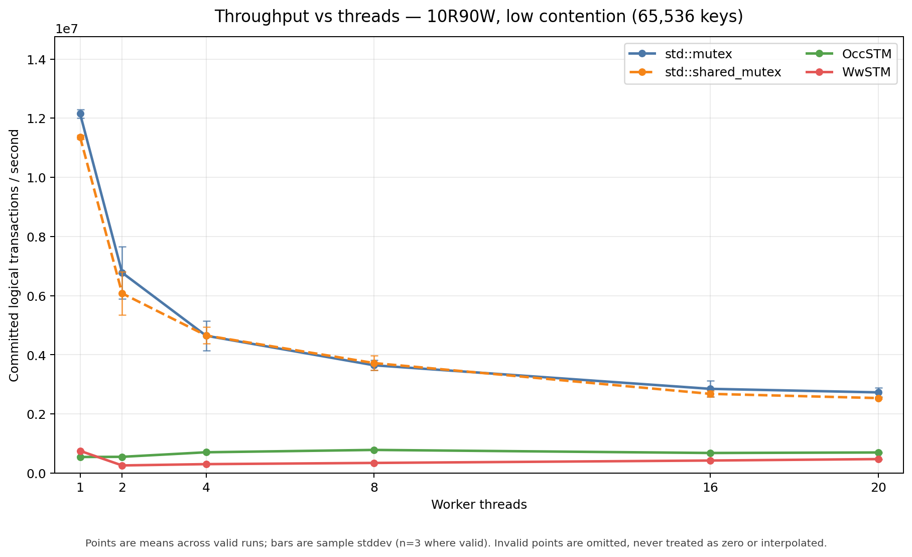
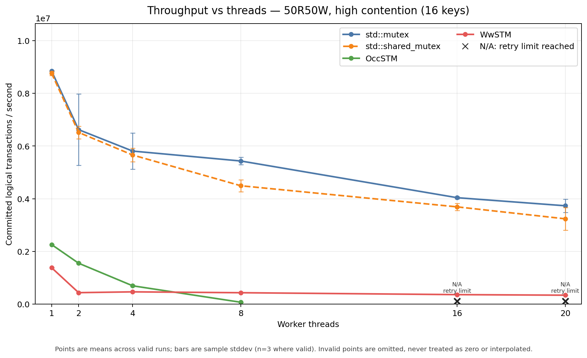
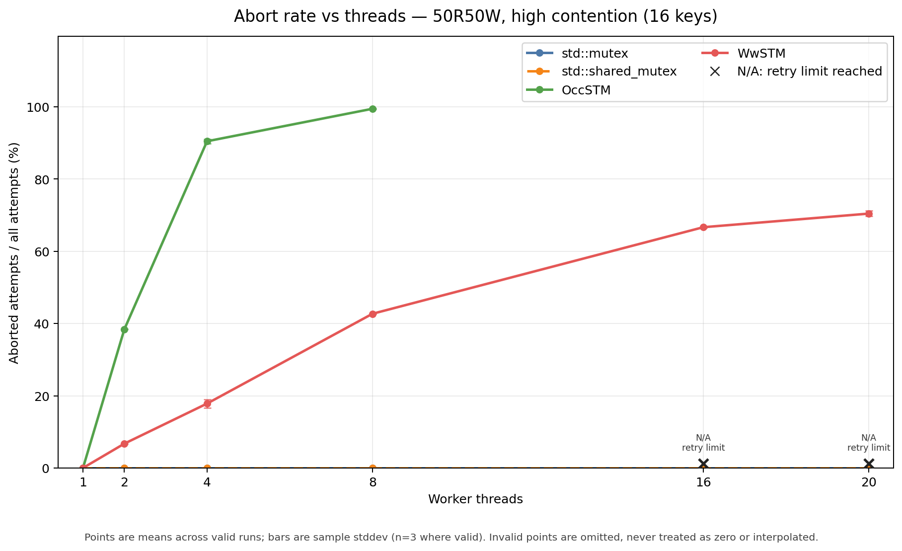
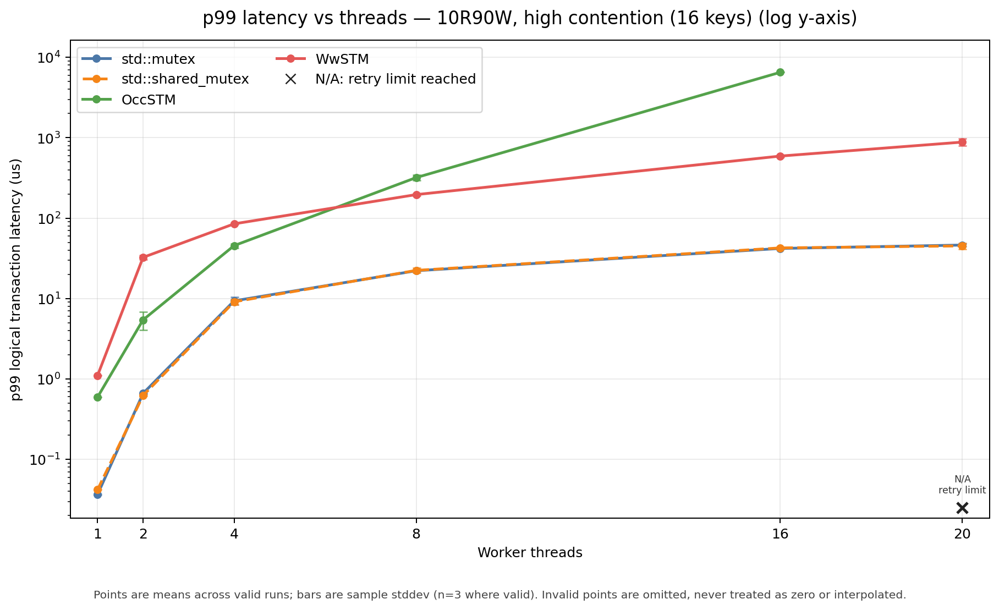

# CaSTM

CaSTM 是一个 C++17 软件事务内存（STM）runtime 原型，用 MVCC、事务重试和
基于 epoch 的安全回收，把并发读写组织成可组合的事务。项目实现了两条并发控制
路线：OccSTM 使用 optimistic validation/retry，WwSTM 使用 Wound-Wait、主动中止
和 single-head Locator。除了 STM 本身，还包含 EBR 和自研 TierAlloc 分配器，并用
多变量原子性测试、压力测试、sanitizer 和可复现 benchmark 验证设计边界。

## Project overview

- C++17 STM runtime，提供 atomically、Transaction 和 TxContext 风格 API。
- OccSTM：读集/写集验证，冲突时重试。
- WwSTM：Wound-Wait 冲突裁决，使用 head -> VersionNode | WriteRecord Locator。
- MVCC 版本链：读者按事务状态选择稳定旧版本或已提交新版本。
- EBR：保护 reader、helper、Record 和 TxDescriptor 的生命周期。
- TierAlloc：CentralHeap -> ThreadHeap -> SizeClassPool 的分层小对象分配器。
- correctness 和 performance 均有独立的测试、结果记录与分析脚本。

## Architecture

~~~text
Application
    ↓
Transaction / TxContext
    ↓
TMVar / VersionNode
    ↓
OccSTM or WwSTM
    ↓
EBR + TierAlloc
~~~

OccSTM 的提交路径维护 read set、write set 和条带锁；WwSTM 的共享变量只有一个
tagged head：

~~~text
head -> VersionNode | WriteRecord

WriteRecord
  ├── owner   -> TxDescriptor
  ├── old_node
  └── new_node
~~~

Record 的逻辑视图由 owner 状态决定：

~~~text
ACTIVE     -> old_node
ABORTED    -> old_node
COMMITTED  -> new_node
~~~

Record 从 head 展平为 Node 是物理清理；它不能改变事务已经确定的逻辑结果。

## Transaction linearization

WwSTM 的事务提交顺序是：

~~~text
validate
    → prepare all published Records
    → ACTIVE --CAS--> COMMITTED
    → help / flatten each Record
~~~

ACTIVE -> COMMITTED descriptor CAS 是事务唯一的 linearization point。多变量事务在
这个 CAS 之前要么整体进入 ABORTED，要么尚未提交；CAS 成功后，所有变量都按同一
descriptor 状态解释为 new_node，后续 Record→Node 只是可被 owner 或 helper 完成
的物理清理。

## Memory reclamation

- 已发布的 WriteRecord 只能 retire，不能复用或直接 delete。
- Record 保存的 old_node/new_node 和 owner 必须在 EBR critical section 中访问。
- 事务终态和所有 published Record 清理完成后，TxDescriptor 才进入 EBR。
- EBR grace period 结束后才执行析构和释放。
- GarbageNode 元数据使用 system allocator；这部分与 payload 的 allocator 配对
  保持独立。

## Correctness story

### 1. Value/version skew -> lost update

旧结构同时维护 data_ptr_ + record_ptr_，读操作可能从一个对象取得 value、从
另一个对象取得 version。修复后 WwSTM 使用单一 tagged head，readSnapshot() 从
同一个 VersionNode 复制 value 和 version，并复核 head identity。这样读集验证
不会再接受拼接出来的 value/version 对。详见
[BUG-06](BUG-06-WwSTM版本值偏斜丢失更新.md) 和
[BUG-07](BUG-07-WwSTM-single-head-Locator协议设计审计.md)。

### 2. EBR premature reclaim -> UAF

退休对象如果使用落后的线程 epoch，可能在仍有 reader/helper 时过早进入可回收
窗口；ThreadHeap 线程退出和 chunk 归还也会放大这个问题。修复包括登记后复核、
使用已登记 epoch、垃圾账本迁出 ThreadHeap、以及不在并发线程退出时暴力归还 chunk。
详见 [BUG-01](BUG-01-ThreadHeap线程退出归还活跃Chunk.md)、
[BUG-02](BUG-02-EBR-retire纪元标记提前回收.md) 和
[BUG-03](BUG-03-EBR默认Deleter堆配对.md)。

### 3. Partial commit -> descriptor linearization

如果先把事务标记为 committed，再逐变量发布结果，owner/helper 交错可能让
commit() 的返回值与共享变量状态脱节。现在先验证并 prepare 全部 Record，再用
一次 ACTIVE -> COMMITTED CAS 确定事务结果；COMMITTED 后 cleanup 只能帮助完成，
不能把事务改回 ABORTED。TxDescriptor 的对齐与延迟回收另见
[BUG-08](BUG-08-WwSTM-TxDescriptor生命周期与对齐.md)。

## Validation

已完成的验证包括：

~~~text
mode=0 full test suite
VERIFY full test suite
ASan + UBSan
high-contention stress
multi-variable atomicity
descriptor churn and EBR lifetime tests
~~~

TSan/LSan runtime validation limited by current WSL/ptrace environment。本项目不把
受环境限制的运行结果写成“已通过”。

## Benchmark

benchmark 使用统一的 Shared KV/Array workload：每个逻辑事务默认执行 8 个确定性
操作，覆盖 90R/10W、50R/50W、10R/90W，低冲突使用 65,536 keys，高冲突使用
16 keys。比较对象为 std::mutex、std::shared_mutex、OccSTM 和 WwSTM；吞吐、
abort rate、p50/p99、attempts、committed 和 checksum 都会写入 CSV。

首次完整矩阵共有 432 个独立 run：

~~~text
mutex          108/108 valid
shared_mutex   108/108 valid
OccSTM          97/108 valid
WwSTM          108/108 valid
~~~

OccSTM 的 11 个 invalid 点全部位于高冲突、16T/20T、50R/50W 或 10R/90W
配置，原因是 1,000,000 次 retry guard 耗尽。它们的 checksum 仍正确，因此是
progress failure，不是 correctness failure。数据也显示 STM 不一定胜过锁：
锁 baseline 在本矩阵中通常更快；WwSTM 的主要优势是高冲突下更稳定地完成，而不是
普遍吞吐领先。

一个代表性的 20T、高冲突、90R/10W 对照是：OccSTM 约 24.5k committed TPS、
99.9% abort、12.22ms p99；WwSTM 约 1.22M committed TPS、12.5% abort、250us
p99。这个结果说明 WwSTM 在该压力点 progress 更稳定，但不代表它在所有 workload
上都优于锁或 OccSTM。

代表图：

构建、runner、汇总和绘图细节见
[benchmarks/README.md](benchmarks/README.md)；完整结果和分析保存在本地
bench/results/，不作为 raw data 提交到仓库。

## Allocator ablation

allocator ablation 保持同一 benchmark harness 和 workload，只在构建期切换：

~~~text
STM_ALLOCATOR_MODE=system
STM_ALLOCATOR_MODE=tier
~~~

本次固定 6 个代表配置，每种 allocator 运行 5 次独立进程，共 60 次运行：

~~~text
57/60 valid
3 invalid
0 checksum mismatch
~~~

完整点上，TierAlloc 在单线程和低冲突 8T 的 throughput 提升约 15.5%～30.3%，
p99 通常下降；但高冲突 WwSTM 20T、10R/90W 下 throughput 下降约 11.0%，
p99 上升约 11.3%，说明 allocator 不是所有场景的普遍赢家。高冲突时冲突管理、
wound/abort 交互和调度成本可能已经主导结果，这是 allocator 对照支持的工程推断，
不是事件级 profiling 结论。

## Build / test / benchmark

项目要求 C++17、CMake 3.14+ 和本地 vendored GoogleTest。下面的命令使用独立的
Release 构建目录，并将 WwSTM mode=0 显式传给测试目标：

~~~bash
cmake -S . -B /tmp/castm-package-release \
  -DCMAKE_BUILD_TYPE=Release \
  -DCMAKE_CXX_FLAGS="-DSTM_WW_VERIFY_LOGIC_MODE=0"
cmake --build /tmp/castm-package-release -j2
ctest --test-dir /tmp/castm-package-release --output-on-failure
~~~

VERIFY 构建：

~~~bash
cmake -S . -B /tmp/castm-package-verify \
  -DCMAKE_BUILD_TYPE=Debug \
  -DCMAKE_CXX_FLAGS="-DSTM_WW_VERIFY_LOGIC_MODE=1"
cmake --build /tmp/castm-package-verify --target run_tests -j2
ctest --test-dir /tmp/castm-package-verify --output-on-failure
~~~

ASan + UBSan 构建：

~~~bash
cmake -S . -B /tmp/castm-package-asan-ubsan \
  -DCMAKE_BUILD_TYPE=Debug \
  -DCMAKE_CXX_FLAGS="-g -O1 -fsanitize=address,undefined -fno-omit-frame-pointer -DSTM_WW_VERIFY_LOGIC_MODE=0" \
  -DCMAKE_EXE_LINKER_FLAGS="-fsanitize=address,undefined"
ASAN_OPTIONS=detect_leaks=0 UBSAN_OPTIONS=halt_on_error=1 \
  cmake --build /tmp/castm-package-asan-ubsan --target run_tests -j2
ASAN_OPTIONS=detect_leaks=0 UBSAN_OPTIONS=halt_on_error=1 \
  ctest --test-dir /tmp/castm-package-asan-ubsan --output-on-failure
~~~

可复现 benchmark smoke run（不在 CI 中执行）：

~~~bash
cmake -S . -B /tmp/castm-bench-release -DCMAKE_BUILD_TYPE=Release
cmake --build /tmp/castm-bench-release --target stm_benchmark -j2
python3 scripts/run_stm_benchmark.py \
  --binary /tmp/castm-bench-release/benchmarks/stm_benchmark \
  --smoke --warmup-ms 100 --measure-ms 300 --repetitions 1
~~~

## Repository layout

~~~text
include/OccSTM     OCC transaction, read/write set and versioned variable
include/WwSTM      Wound-Wait context, Locator, Record and descriptor protocol
include/EBRManager epoch slots, retirement and deferred reclamation
include/TierAlloc  CentralHeap, ThreadHeap and size-class allocator
src/EBRManager     EBR implementation units
src                allocator and STM implementation units
benchmarks         unified benchmark executable and benchmark documentation
scripts             benchmark runners, summarizers and plotting tools
tests               GoogleTest correctness, stress and lifetime tests
BUG-*.md            one document per investigated root cause
docs/interview     resume bullets and project presentation notes
~~~

## Project status

The correctness baseline is tagged wwstm-correctness-stable at 540ac36b. The performance
benchmark and allocator ablation are reproducible on the recorded WSL2 host, with invalid
progress points preserved as N/A. The next work is presentation polish rather than another
protocol rewrite.
